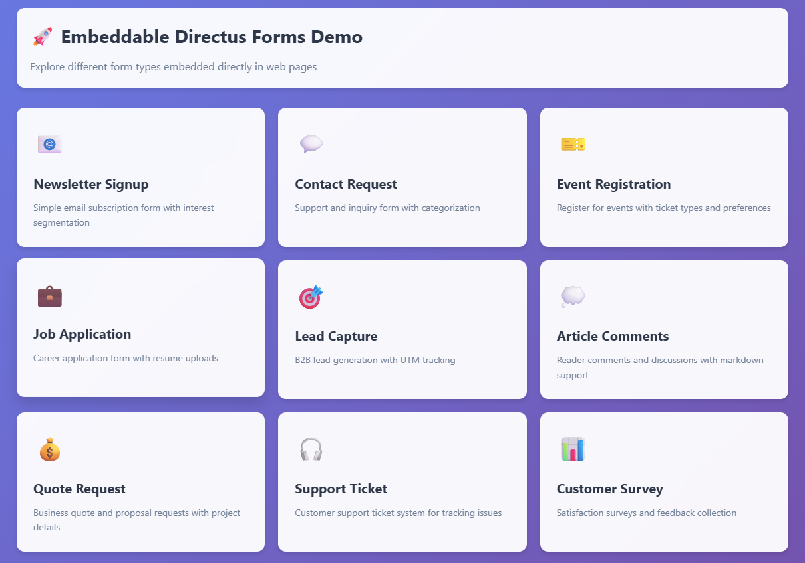
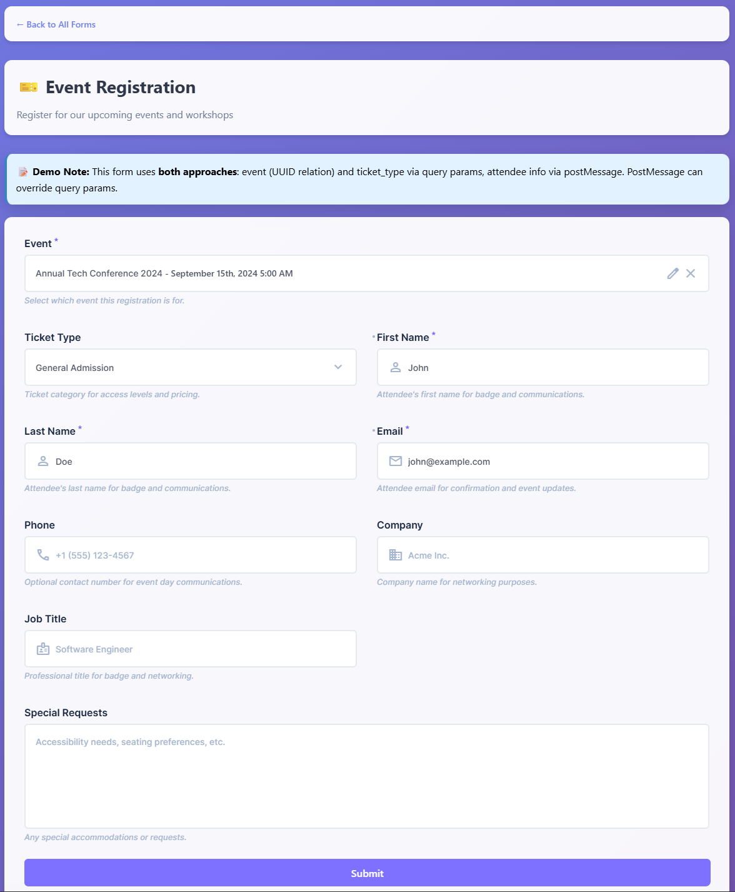
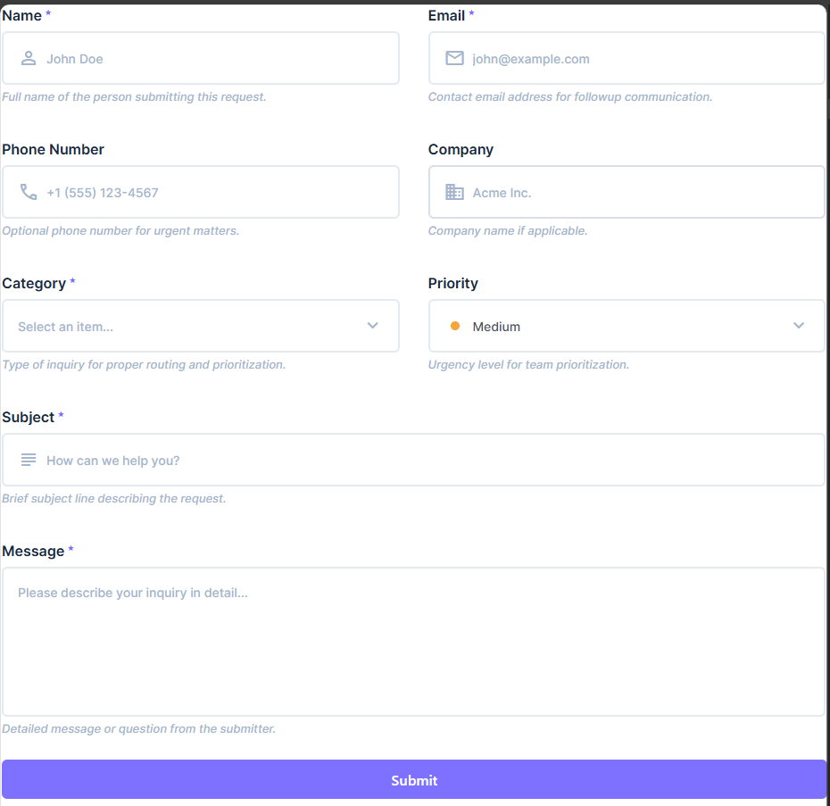
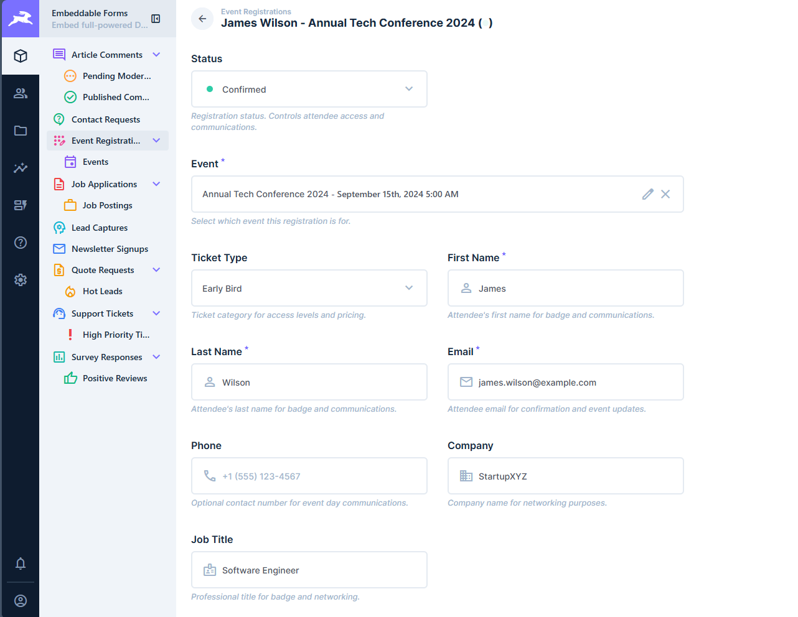
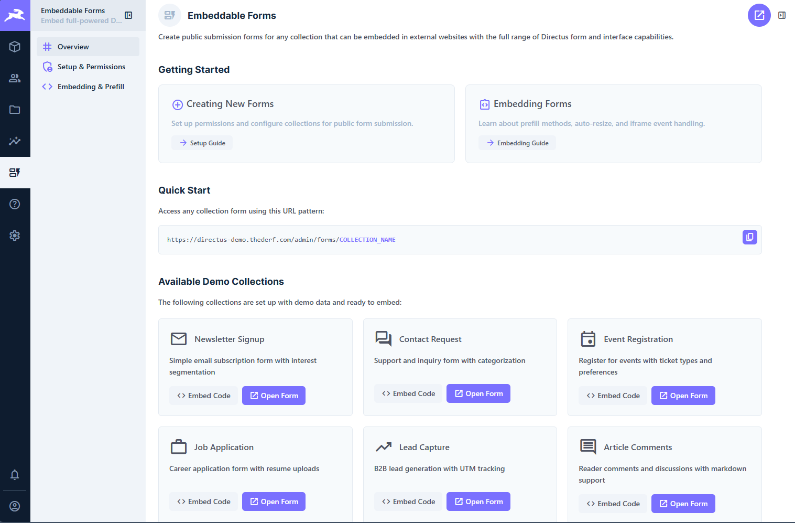

# Embeddable Forms Template

Embed Directus forms on any website with prefill support, iframe communication, and auto-resize. Includes 9 pre-built collections for common use cases.

> **Try the Live Demo:** [https://directus-demo.thederf.com/dirserve/](https://directus-demo.thederf.com/dirserve/)

## Why We Built This

Directus has powerful form interfaces but no easy way to embed them on external websites. This template solves that problem.

I needed embedded forms for my wedding RSVP and several work projects. Rather than installing heavy component frameworks just for forms, this template lets you use Directus's existing form system on any website, including static sites.

This also demonstrates Directus's flexibility—both frontend and backend can be extended significantly beyond the standard admin interface.

## Features

- Embed any Directus collection as a public form
- 9 pre-configured collections (contact, newsletter, events, jobs, support, etc.)
- Pre-populate fields via URL parameters or postMessage API
- Iframe auto-resize and bidirectional communication
- Full support for Directus validation, conditions, and custom interfaces
- Pre-configured public permissions for secure submissions
- Working demo pages for each collection

## Tech Stack

**Backend**
- Directus (data platform and admin interface)
- Custom Directus module extension for form rendering

**Development Tools**
- Directus MCP (Model Context Protocol for AI-assisted development)
- Claude Code (AI coding assistant)
- directus-serve extension (demo hosting)

## Setup Instructions

### Prerequisites

- Docker and Docker Compose (for local development)
- Node.js (for template installation on existing instances)
- Directus instance (v10+) or use the included Docker setup

### Local Development

1. Clone the repository:

```bash
git clone https://github.com/yourusername/directus-template-embeddable-forms.git
cd directus-template-embeddable-forms/directus
```

2. Copy the environment file:

```bash
cp .env.example .env
```

3. Start Directus with Docker:

```bash
docker compose up -d
```

4. Install the template:

```bash
npx directus-template-cli@latest apply -h localhost -p 8055 -e admin@example.com -P d1r3ctu5 ../template
```

5. Restart the container to load extensions:

```bash
docker compose restart
```

6. Access Directus:
   - Admin: `http://localhost:8055`
   - Demos: `http://localhost:8055/dirserve/index.html`

Default credentials: `admin@example.com` / `d1r3ctu5`

### Installation on Existing Instance

1. Install the template using Directus template CLI:

```bash
npx directus-template-cli@latest apply [CONNECTION_PARAMETERS] ./directus/template
```

2. Restart your Directus instance

3. Access demos at: `https://your-directus-url/dirserve/index.html`

### What Gets Installed

- 9 pre-configured collections with sample data
- Embeddable forms extension (admin module + public routes)
- directus-serve extension for demo hosting
- Public role permissions for form submissions
- Demo HTML pages and assets

### Included Collections

1. **contact_requests** - Contact forms with priority/category
2. **newsletter_signups** - Email subscriptions with interests
3. **lead_captures** - Lead forms with UTM tracking
4. **event_registrations** - Event signups with ticket types
5. **job_applications** - Career forms with file uploads
6. **support_tickets** - Support requests with priority
7. **quote_requests** - Quote/proposal requests
8. **survey_responses** - Satisfaction surveys with ratings
9. **article_comments** - Blog comments with markdown

## Demo

**Live Demo**: [https://directus-demo.thederf.com/dirserve/](https://directus-demo.thederf.com/dirserve/)

**Video Walkthrough**: [Watch on YouTube](https://www.youtube.com/watch?v=6DcpQy0i9vA)

**Local Demos**: After installation, access at `https://your-directus-url/dirserve/index.html`

## Screenshots

### Index page showing all demo forms


### Event registration form embedding example


### Contact form as it appears prior to embedding


### Submitted form data visible in Directus backend


### Extension documentation in Directus Admin App



## Usage

### Basic Embedding

```html
<iframe
  src="https://your-directus-url/admin/forms/contact_requests"
  style="width: 100%; border: none;"
  id="contact-form">
</iframe>
```

### Prefilling Fields

**Via URL parameters:**

```html
<!-- Bracket notation -->
<iframe src="https://your-directus-url/admin/forms/newsletter_signups?prefill[email]=user@example.com"></iframe>

<!-- Dot notation -->
<iframe src="https://your-directus-url/admin/forms/lead_captures?prefill.email=user@example.com"></iframe>
```

**Via postMessage API:**

```javascript
const iframe = document.getElementById('my-form');

window.addEventListener('message', (event) => {
  if (event.origin !== 'https://your-directus-url') return;

  if (event.data.type === 'directus-form-ready') {
    iframe.contentWindow.postMessage({
      type: 'directus-form-prefill',
      data: {
        email: 'user@example.com',
        first_name: 'John'
      }
    }, 'https://your-directus-url');
  }
});
```

### Auto-Resize

```javascript
window.addEventListener('message', (event) => {
  if (event.origin !== 'https://your-directus-url') return;

  if (event.data.type === 'directus-form-resize') {
    const iframe = document.getElementById('my-form');
    iframe.style.height = event.data.data.height + 'px';
  }
});
```

### Handling Submissions

```javascript
window.addEventListener('message', (event) => {
  if (event.origin !== 'https://your-directus-url') return;

  switch (event.data.type) {
    case 'directus-form-submitted':
      window.location.href = '/thank-you';
      break;
    case 'directus-form-error':
      alert('Submission error. Please try again.');
      break;
  }
});
```

### Configuring Permissions for New Forms

For each custom form collection, configure the Public role:

1. **Create Permission**: All Fields
2. **Read Permission**: All Fields with filter:
   ```json
   {
     "_and": [
       { "id": { "_null": true } }
     ]
   }
   ```

This allows schema access while blocking data reads.

**System collections** (Public role needs read access):
- `directus_collections`
- `directus_fields`
- `directus_relations`

**File uploads**: Grant Public role create permission on `directus_files` with appropriate folder restrictions.

## Project Structure

```
directus-template-embeddable-forms/
├── directus/
│   ├── docker-compose.yaml
│   ├── .env.example
│   ├── extensions/
│   │   └── directus-extension-embeddable-forms/
│   │       ├── src/
│   │       │   ├── index.ts
│   │       │   ├── module.vue
│   │       │   ├── routes/
│   │       │   └── utils/
│   │       └── package.json
│   └── template/
│       ├── collections.json
│       ├── fields.json
│       ├── relations.json
│       ├── permissions.json
│       ├── policies.json
│       ├── roles.json
│       ├── extensions.json
│       ├── files.json
│       ├── folders.json
│       ├── content/
│       │   ├── contact_requests.json
│       │   ├── newsletter_signups.json
│       │   └── ...
│       └── assets/
│           ├── index.html
│           ├── contact.html
│           └── ...
├── screenshots/
├── package.json
├── LICENSE
└── README.md
```

## Key Implementation Details

### Built with Directus MCP

This project was built almost entirely using Directus MCP and Claude Code. MCP handled collection creation, permissions configuration, and test data, while Claude generated the extension code, demos, and documentation. Manual intervention was only needed for admin router integration.

Using MCP saved significant time by allowing simultaneous code and database configuration, eliminating the need to constantly lookup collection/field names.

### Module Public Routes

Directus modules can't register public routes by default. Solution: extract the Vue app instance from the `#app` DOM element and hook into the router directly. Login redirects are intercepted and force-redirected back to form pages when appropriate.

### Admin App Stores

Directus admin stores initialize after login. Public forms don't go through login, so these stores need manual initialization. Some stores can be triggered to hydrate, others require data injection.

### Theming

iframes need matching `color-scheme` meta/CSS properties for transparent backgrounds. Directus's internal color scheme meta tag was removed to enable this.

### Iframe Communication

Uses postMessage API for secure cross-origin communication. All events include collection context for multi-form implementations.

## Future Improvements

- File upload support (requires manual user/permission store population)
- Custom styling themes
- More robust testing for relational interfaces (currently only M2O tested)

## Team

- [thederf](https://github.com/thederf) - Template creator

## License

MIT

## Acknowledgments

Built with:
- [Directus](https://directus.io) - Open-source data platform
- [Directus MCP](https://directus.io/mcp) - Model Context Protocol integration
- [Claude Code](https://claude.ai) - AI development assistant
- [directus-serve](https://github.com/directus-labs/directus-serve) - File serving extension
